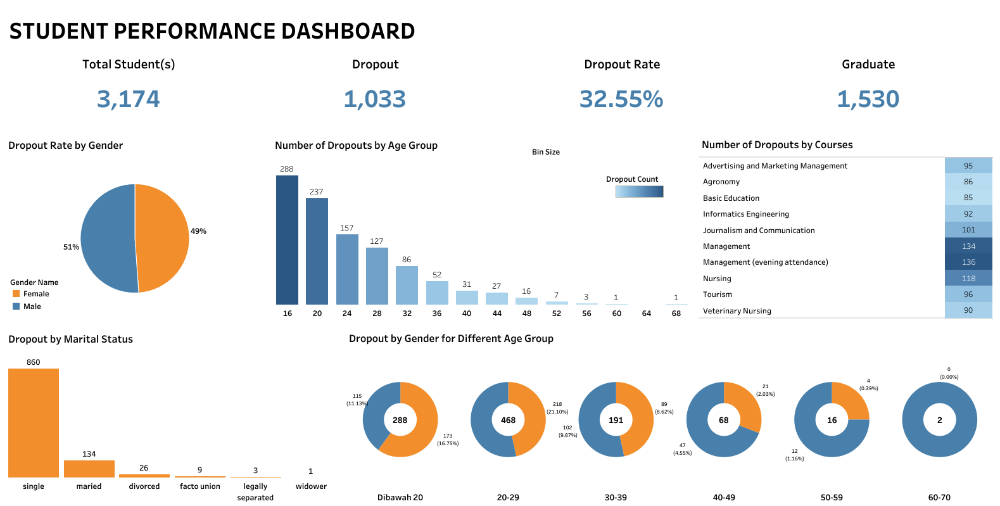

# Proyek Akhir: Menyelesaikan Permasalahan Jaya Jaya Institut

## Business Understanding

Jaya Jaya Institut, sebagai institusi pendidikan yang telah beroperasi sejak tahun 2000 dan memiliki reputasi baik, menghadapi tantangan serius terkait tingginya tingkat siswa yang dropout (berhenti kuliah sebelum lulus). Meskipun banyak lulusan sukses yang dihasilkan, angka putus studi menjadi indikator negatif yang berdampak pada kualitas, citra, dan keberlanjutan institusi dalam jangka panjang.

### Permasalahan Bisnis

1. **Tingginya Tingkat Dropout Mahasiswa**.
Tingkat mahasiswa yang keluar sebelum menyelesaikan studi menunjukkan angka yang mengkhawatirkan, yang dapat berdampak negatif pada reputasi institusi, menurunkan akreditasi, serta mengurangi pendapatan dari biaya pendidikan.
2. **Kurangnya Pemahaman Terhadap Faktor Penyebab Dropout**.
Pihak institusi belum memiliki analisis komprehensif mengenai faktor-faktor utama yang menyebabkan mahasiswa berhenti kuliah, seperti latar belakang ekonomi, performa akademik, kondisi sosial, atau motivasi pribadi.
3. **Ketidakmampuan dalam Memprediksi Mahasiswa yang Berisiko Dropout**.
Tidak adanya sistem atau alat bantu berbasis data untuk memantau dan mengidentifikasi mahasiswa yang berisiko tinggi dropout membuat intervensi pencegahan sulit dilakukan secara tepat waktu dan tepat sasaran.
4. **Kesulitan Menyusun Strategi Intervensi dan Bimbingan yang Efektif**.
Tanpa pemetaan yang jelas terhadap profil risiko mahasiswa, institusi kesulitan dalam merancang program pendampingan, bimbingan akademik, atau dukungan psikologis yang tepat untuk menekan angka dropout.

### Cakupan Proyek

- Mengolah dan menganalisis dataset mahasiswa dari Jaya Jaya Institut.
- Melakukan eksplorasi data untuk menemukan pola spesifik dalam dropout berdasarkan kategori demografis, status keuangan, dan performa akademik.
- Pembuatan Business Dashboard yang mencakup : 
  - Tingkat dropout keseluruhan dan per program studi
  - Distribusi mahasiswa berdasarkan usia, status pernikahan, dan status beasiswa
  - Trend dropout berdasarkan usia
- Pemberian Rekomendasi Bisnis untuk strategi pencegahan dropout berdasarkan temuan data.

### Persiapan

Sumber data: [Student Performance Data](https://github.com/dicodingacademy/dicoding_dataset/blob/main/students_performance/README.md)

#### Setup environment

```
# 1. Salin Repository dari GitHub
git clone https://github.com/fabasassa-lab/HR_Analysis.git

# 2. Pindah ke Folder Proyek
cd nama-repository
```

```
conda create -n env-attrition python=3.10

conda activate env-attrition

pip install pandas numpy matplotlib seaborn scikit_learn tensorflow joblib streamlit xgboost

conda deactivate
```

## Business Dashboard

Link Student Performance Tableau Public Dashboard : [Student Performance Dashboard](https://public.tableau.com/app/profile/fauzihan.bagus/viz/StudentPerformanceAnalysis_17462562479090/Student)

Dashboard ini menyajikan berbagai visualisasi analitik yang komprehensif terkait performa dan keberlangsungan studi mahasiswa di Jaya Jaya Institut, khususnya dalam memantau dan menganalisis tingkat dropout mahasiswa. Informasi yang ditampilkan mencakup total mahasiswa, jumlah dan persentase dropout, jumlah lulusan, serta distribusi dropout berdasarkan usia, gender, status pernikahan, dan program studi yang diambil.

Dashboard ini berfungsi sebagai alat strategis berbasis data untuk membantu pihak manajemen akademik dalam memahami profil dan karakteristik mahasiswa yang berisiko tinggi untuk dropout. Dengan visualisasi yang sistematis dan interaktif, manajemen dapat dengan cepat mengidentifikasi kelompok usia, jurusan, atau status sosial tertentu yang memiliki tingkat dropout tinggi, sehingga dapat dirancang intervensi dini seperti bimbingan akademik atau dukungan psikososial.



## Menjalankan Sistem Machine Learning
Untuk menjalankan protoype sistem machine learning yang telah dibuat, ikuti langkah di bawah ini:

```
# Clone the repository
git clone <repository-url>

# Install necessary packages
pip install numpy pandas xgboost sqlalchemy scikit-learn joblib streamlit

# Run the Streamlit app
streamlit run app.py
```

Link Student Performance Prediction (Streamlit) : [Streamlit App](https://studentperformanceanalysis-n5yfnn72v5g4ukudrcsgem.streamlit.app/)

## Conclusion

Berdasarkan analisis data dalam dashboard, ditemukan insight berikut:

1. **Tingkat dropout mahasiswa mencapai 32,55% dari total 3.174 mahasiswa**.
Angka ini menunjukkan bahwa hampir sepertiga mahasiswa tidak menyelesaikan studinya, menandakan adanya masalah serius dalam retensi dan keberlangsungan pendidikan di institusi.
2. **Mahasiswa berusia di bawah 20 tahun mendominasi kasus dropout (288 orang), disusul kelompok usia 20–29 tahun (468 orang)**.
Hal ini menunjukkan bahwa mahasiswa di awal masa studi rentan mengalami kesulitan beradaptasi atau mengalami hambatan akademik/psikologis yang menyebabkan dropout.
3. **Status pernikahan ‘single’ memiliki tingkat dropout paling tinggi, yaitu sebanyak 860 orang**.
Ini mengindikasikan bahwa mayoritas dropout berasal dari mahasiswa yang belum menikah, kemungkinan besar adalah mahasiswa baru atau masih muda yang mungkin menghadapi tekanan pribadi, finansial, atau kurangnya dukungan sosial.
4. **Gender tidak menunjukkan perbedaan signifikan, dengan dropout hampir merata antara pria (51%) dan wanita (49%)**.
Artinya, faktor gender bukanlah penentu utama dropout, sehingga intervensi lebih perlu difokuskan pada faktor lain seperti usia, jurusan, atau kondisi sosial.
5. **Program studi 'Management (evening attendance)' dan 'Management' mencatat dropout tertinggi, masing-masing 136 dan 134 orang**.
Hal ini dapat mengindikasikan adanya beban kuliah yang tidak seimbang dengan aktivitas harian, khususnya bagi mahasiswa kelas malam yang kemungkinan juga bekerja, sehingga mengalami kelelahan atau kurang fokus dalam studi.

### Rekomendasi Action Items

Berikan beberapa rekomendasi action items yang harus dilakukan perusahaan guna menyelesaikan permasalahan atau mencapai target mereka.

- Tingkatkan sistem bimbingan akademik dan konseling untuk mahasiswa usia di bawah **20 tahun** dan **20–29 tahun**, karena dua kelompok ini menyumbang dropout terbanyak. Fokuskan pada transisi dari SMA ke perguruan tinggi serta manajemen stres dan waktu belajar.
- Kembangkan program dukungan sosial dan finansial untuk mahasiswa dengan status **'single'**, karena kelompok ini menyumbang dropout tertinggi. Bantuan dapat berupa beasiswa, dukungan psikologis, atau kegiatan komunitas untuk memperkuat keterikatan mereka dengan kampus.
- Tinjau kembali kurikulum dan beban studi program studi **Manajemen (terutama kelas malam)**, serta evaluasi kebutuhan mahasiswa yang bekerja sambil kuliah. Pertimbangkan fleksibilitas jadwal atau metode pembelajaran hybrid untuk meningkatkan retensi.
- Adakan survei lanjutan untuk mengeksplorasi lebih dalam alasan dropout di tiap program studi, terutama pada jurusan dengan angka dropout tinggi seperti **Management, Nursing, dan Journalism & Communication**.
- Bangun sistem pemantauan dini (early warning system) berbasis data akademik, kehadiran, dan partisipasi mahasiswa untuk mendeteksi potensi dropout sejak dini, sehingga intervensi bisa dilakukan lebih cepat dan tepat sasaran.
