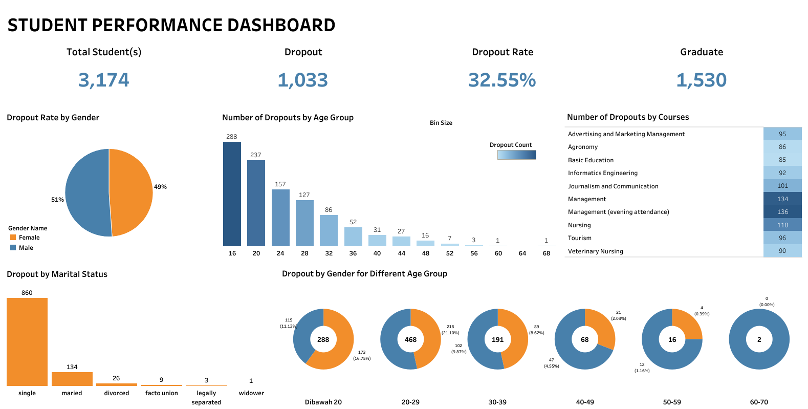

# Proyek Akhir: Menyelesaikan Permasalahan Perusahaan Jaya Jaya Maju

## Business Understanding

Jaya Jaya Maju merupakan perusahaan multinasional yang telah berdiri sejak tahun 2000 dan kini mempekerjakan lebih dari 1.000 karyawan yang tersebar di seluruh wilayah Indonesia. Seiring pertumbuhan perusahaan yang semakin besar, tantangan dalam pengelolaan sumber daya manusia pun semakin kompleks. Salah satu permasalahan utama yang dihadapi adalah tingginya angka attrition rate, yakni rasio jumlah karyawan yang keluar terhadap total karyawan, yang telah mencapai lebih dari 10%.

Tingginya attrition rate ini menimbulkan berbagai risiko serius bagi perusahaan, seperti menurunnya produktivitas, meningkatnya biaya rekrutmen dan pelatihan, serta terganggunya stabilitas organisasi. Menyadari urgensi permasalahan ini, manajemen HR berinisiatif untuk melakukan analisis lebih lanjut guna mengidentifikasi faktor-faktor utama yang mendorong keluarnya karyawan dari perusahaan.

Untuk mendukung proses analisis tersebut, manajemen juga mengusulkan pembuatan sebuah business dashboard yang dapat digunakan untuk memantau secara real-time berbagai indikator penting terkait tenaga kerja, seperti distribusi karyawan, tingkat kepuasan kerja, latar belakang pendidikan, serta departemen dan kelompok usia yang paling rentan terhadap attrition. Dataset terkait kondisi karyawan pun telah disediakan guna menunjang analisis dan pengembangan dashboard tersebut.

Melalui pendekatan berbasis data ini, diharapkan Jaya Jaya Maju dapat mengembangkan strategi retensi karyawan yang lebih efektif, memperbaiki kepuasan kerja, serta meningkatkan daya saing perusahaan di masa depan.

### Permasalahan Bisnis

1. **Tingginya Tingkat Attrition (Turnover) Karyawan**.
Rasio attrition yang mencapai lebih dari 10% menunjukkan bahwa perusahaan kehilangan karyawan dalam jumlah signifikan, yang berpotensi mengganggu produktivitas dan stabilitas operasional.
2. **Kurangnya Pemahaman Terhadap Faktor Penyebab Attrition**.
Perusahaan belum memiliki analisis mendalam mengenai faktor-faktor apa saja (seperti usia, departemen, gender, pendidikan, atau kepuasan kerja) yang paling berpengaruh terhadap tingginya tingkat keluar masuk karyawan.
3. **Ketidakmampuan dalam Memantau Kinerja dan Kondisi Tenaga Kerja Secara Real-Time**.
Saat ini perusahaan belum memiliki sistem dashboard yang dapat memvisualisasikan data tenaga kerja secara cepat dan akurat, sehingga sulit untuk melakukan pemantauan berkelanjutan dan pengambilan keputusan berbasis data.
4. **Kesulitan Mengembangkan Strategi Retensi Karyawan yang Tepat**.
Tanpa data dan pemetaan yang jelas mengenai sumber masalah, upaya perusahaan dalam mengurangi attrition dan meningkatkan kepuasan kerja berisiko menjadi tidak efektif atau tidak tepat sasaran.

### Cakupan Proyek

- Mengolah dan menganalisis dataset karyawan perusahaan Jaya Jaya Maju.
- Melakukan eksplorasi data untuk menemukan pola spesifik dalam attrition berdasarkan kategori demografis dan job role tertentu.
- Pembuatan Business Dashboard yang mencakup : 
  - Attrition Rate keseluruhan dan per departemen
  - Distribusi karyawan berdasarkan usia, gender, dan bidang pendidikan
  - Tingkat kepuasan kerja per job role
  - Trend attrition berdasarkan waktu
- Pemberian Rekomendasi Bisnis

### Persiapan

Sumber data: [Employee Data](https://github.com/dicodingacademy/dicoding_dataset/blob/main/employee/employee_data.csv)

#### Setup environment

```
# 1. Salin Repository dari GitHub
git clone https://github.com/fabasassa-lab/HR_Analysis.git

# 2. Pindah ke Folder Proyek
cd nama-repository
```

```
conda create --name main-ds python=3.10
conda activate main-ds
pip install pandas numpy matplotlib seaborn scikit_learn tensorflow joblib gdown
```

#### Run prediction.py

```
python prediction.py
```

## Business Dashboard

Link HR Analysis Tableau Public Dashboard : [HR Analysis Dashboard](https://public.tableau.com/app/profile/fauzihan.bagus/viz/HRAnalysis_17457576868510/HRANALYTICSDASHBOARD)

Dashboard ini menyajikan berbagai visualisasi analitik yang komprehensif terkait Human Resources (HR) Analytics, meliputi data mengenai attrition rate, distribusi karyawan berdasarkan departemen, rentang usia, jenis kelamin, latar belakang pendidikan, serta tingkat kepuasan kerja.
Dashboard ini berfungsi sebagai alat strategis untuk memberikan insight berbasis data kepada manajemen dalam memahami dinamika tenaga kerja di organisasi secara lebih mendalam.

Dengan pemetaan visual yang sistematis, manajemen dapat dengan cepat mengidentifikasi area kritis dengan tingkat turnover tinggi, menganalisis faktor penyebab, serta merancang program intervensi yang lebih efektif dan terfokus untuk meningkatkan retensi, kepuasan, dan keterlibatan karyawan.
Penggunaan dashboard ini memperkuat komitmen perusahaan terhadap pengelolaan sumber daya manusia berbasis data (data-driven HR management), sekaligus mendukung pengambilan keputusan yang lebih cepat, akurat, dan strategis guna menghadapi tantangan tenaga kerja yang semakin dinamis.



## Conclusion

Berdasarkan analisis data dalam dashboard, ditemukan insight berikut:

1. **Departemen R&D memiliki tingkat attrition tertinggi sebesar 56,12%**.
Hal ini menunjukkan adanya tantangan signifikan dalam mempertahankan karyawan di R&D, kemungkinan disebabkan oleh tekanan target penjualan yang tinggi, persaingan industri yang ketat, atau kurangnya jalur pengembangan karir yang jelas.
2. **Karyawan berusia 25–34 tahun menjadi kelompok dengan tingkat attrition tertinggi sebesar 47%**.
Kelompok usia ini biasanya terdiri dari profesional muda yang aktif mencari peluang pertumbuhan karir, kompensasi lebih baik, atau keseimbangan kehidupan kerja yang lebih ideal.
3. **Gender juga menjadi faktor penting, dengan karyawan laki-laki menyumbang attrition lebih tinggi dibanding perempuan**.
Hal ini bisa mengindikasikan adanya perbedaan kebutuhan, kepuasan kerja, atau peluang karir antara gender yang perlu ditangani secara lebih spesifik.
4. **Kepuasan kerja berpengaruh besar terhadap tingkat attrition**.
Job role seperti Sales Executive dan Laboratory Technician memperlihatkan tingkat kepuasan yang rendah, sedangkan Research Scientist relatif lebih puas. Hal ini mengisyaratkan perlunya perbaikan manajemen beban kerja, reward system, dan peluang pengembangan di role yang lebih rentan terhadap ketidakpuasan.
5. **Bidang pendidikan Life Sciences paling terdampak attrition**.
Ini menandakan adanya ketidakcocokan antara ekspektasi lulusan bidang ini dengan realita pekerjaan yang ditawarkan perusahaan, atau kurangnya jalur pengembangan karir yang sesuai.

### Rekomendasi Action Items

Berikan beberapa rekomendasi action items yang harus dilakukan perusahaan guna menyelesaikan permasalahan atau mencapai target mereka.

- Buat program pengembangan karir, mentoring, dan keseimbangan kerja-hidup (work-life balance) yang lebih menarik untuk usia **25-34**.
- Desain program onboarding yang lebih ramah bagi generasi muda dan program pensiun bertahap (phased retirement) untuk karyawan senior.
- Buat program peningkatan kepuasan kerja seperti pelatihan tambahan, perbaikan beban kerja, atau reward system yang lebih baik di role **Sales Executive** dan **Laboratory Technician**.
- Evaluasi kembali kebijakan rekrutmen, program onboarding, dan program retention untuk latar belakang pendidikan **Life Sciences** dan **Medical**.
- Teliti lebih lanjut penyebab spesifik mengapa banyak karyawan pria keluar, misal terkait beban kerja, peluang promosi, atau fleksibilitas kerja.
